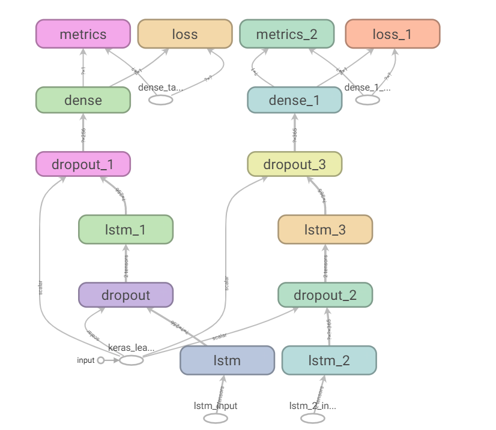
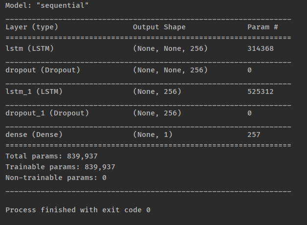
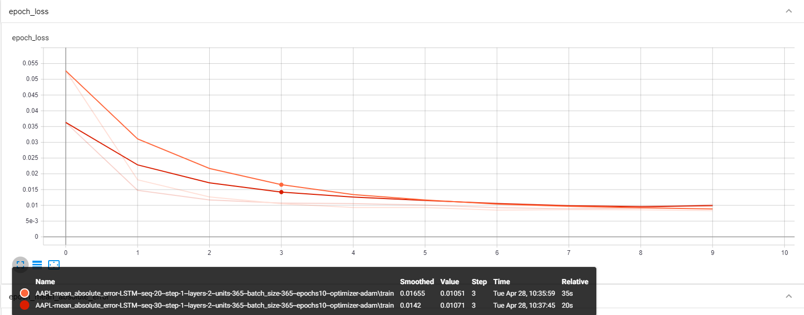
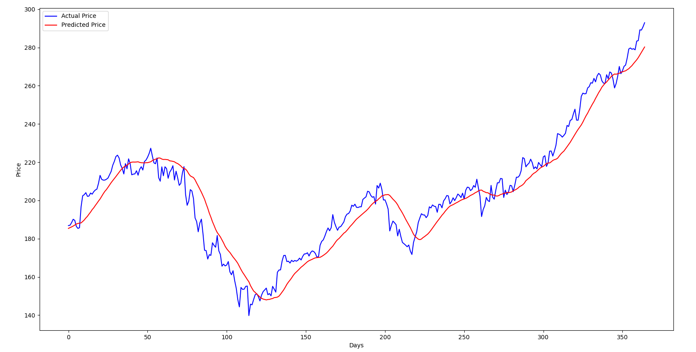
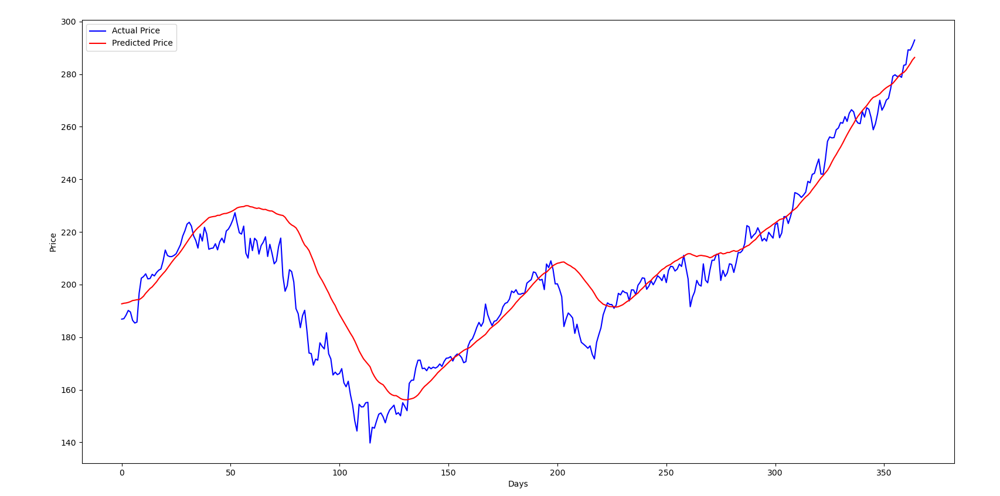
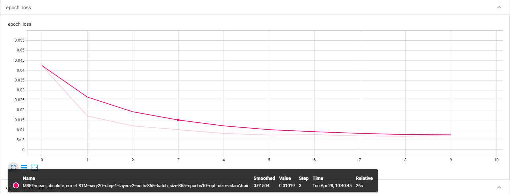
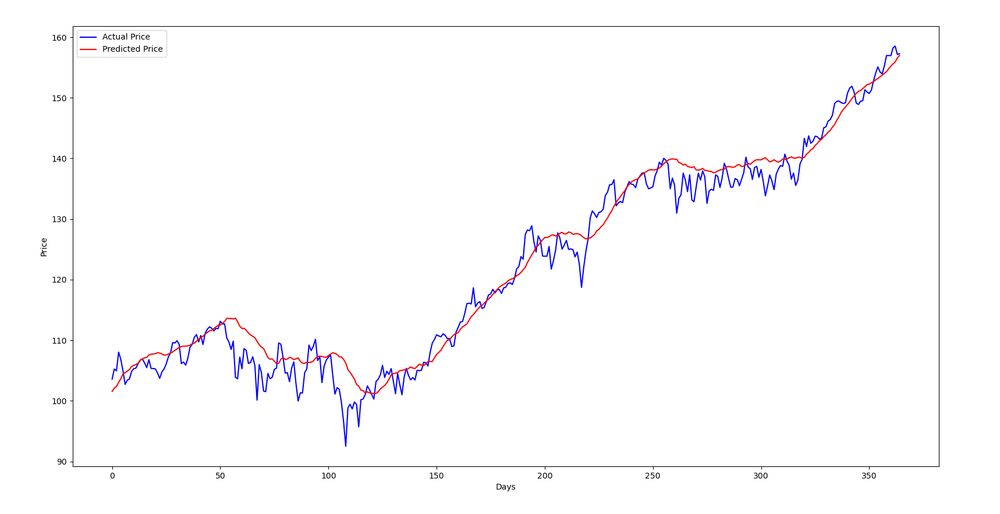

# Stock trending using Machine Learning

## MỤC LỤC : 

### [Stock trending using Machine Learning](#stock-trending-using-machine-learning)
#### [I. MỤC LỤC](#mục-lục-)
#### [II. Chi tiết đề tài](#chi-tiết-đề-tài-)
#### [III. Chương trình chính](#chương-trình-chính-)
- [1. Chức năng các file](#1-chức-năng-các-file-)
- [2. Mô hình LSTM 2 lớp](#2-mô-hình-lstm-2-lớp-)
    - [2.1. Dự đoán cổ phiếu Apple](#21-dự-đoán-cổ-phiếu-apple-)
    - [2.2. Dự đoán cổ phiếu Microsoft](#22-dự-đoán-cổ-phiếu-microsoft-)
- [3. Kết nối với cơ sở dữ liệu](#3-kết-nối-với-cơ-sở-dữ-liệu-)
#### [IV. Các chương trình thử nghiệm](#các-chương-trình-thử-nghiệm-)
- [1. TEST 1](https://github.com/ThanhPP/HUST_20192_Project2/tree/master/Test124032020)
- [2. TEST 2](https://github.com/ThanhPP/HUST_20192_Project2/tree/master/Test042020)
#### [V. Tài liệu tham khảo](#tài-liệu-tham-khảo-)

## Chi tiết đề tài : 

_ **Tên học phần** : Project 2.

_ **Tên đề tài** : Ứng dụng học máy trong phân tích dữ liệu tài chính.

_ **Người hướng dẫn** : giảng viên Đỗ Tuấn Anh.

_ **Sinh viên thực hiện** : Phan Phú Thành.

_ [**Các tài liệu khác**](https://drive.google.com/open?id=1bVA8XYJ_cDb9mNIbi9VGlNTvnni_0VFJ)

## Chương trình chính :

### 1. Chức năng các file :

_ main.py : chương trình chính để thực thi.

_ ticker.py : để lấy và xử lý dữ liệu về chỉ số chứng khoán.

_ model.py : tạo model từ tensorflow.

### 2. Mô hình LSTM 2 lớp : 





_ Mô tả mô hình :
- Lớp thứ 1 : LSTM
- Lớp thứ 2 : [Dropout](https://www.phamduytung.com/blog/2019-05-05-deep-learning-dropout/) (rate = 0.3)
- Lớp thứ 3 : LSTM
- Lớp thứ 4 : Dense = 1 (chỉ đưa ra 1 giá trị là giá cổ phiếu theo lookup_steps)

#### 2.1. Dự đoán cổ phiếu Apple :
_ Thông tin giá lấy về : 01/01/2001 - 31/12/2019

_ Thông số cho model :
```python
BATCH_SIZE = 365
EPOCHS = 10
UNITS = 365
CELL = LSTM
N_LAYERS = 2
DROPOUT = 0.3
LOSS = "mean_absolute_error"
OPTIMIZER = "adam"

# data
LOOKUP_STEPS = 1
N_STEPS = 20
TEST_SIZE = 0.1
```

_ Epoch loss khi train 



- Khi thay đổi N_Steps(Độ dài đầu vào cho model) :
    - Loss ban đầu khi N_Steps lớn hơn là nhỏ hơn.
    - Tuy nhiên thì sau khoảng 5 epochs thì giá trị ổn định và giảm chậm.
    - Sau khoảng 6 epochs thì chênh lệch giữa 2 model là không đáng kể.
    
_ Biểu đồ giá trị dự đoán 365 ngày cuối của tập test :
- N_STEPS = 20 : 

mse = 0.023677738003040613 ----- mae = 0.02367773838341236

Mean Absolute Error: 7.730722



- N_STEPS = 30 :

mse = 0.02757912206184512 ----- mae = 0.02757912315428257

Mean Absolute Error: 8.870477


    

    
#### 2.2. Dự đoán cổ phiếu Microsoft :
_ Thông tin giá lấy về : 01/01/2001 - 31/12/2019

_ Thông số cho model :
```python
BATCH_SIZE = 365
EPOCHS = 10
UNITS = 365
CELL = LSTM
N_LAYERS = 2
DROPOUT = 0.3
LOSS = "mean_absolute_error"
OPTIMIZER = "adam"

# data
LOOKUP_STEPS = 1
N_STEPS = 20
TEST_SIZE = 0.1
```

_ Epoch loss khi train :


_ Biểu đồ giá trị dự đoán 365 ngày cuối của tập test :

mse = 0.014268360381063662 ----- mae = 0.0142683619633317

Mean Absolute Error: 13.794232



### 3. Kết nối với cơ sở dữ liệu :
_ [Crawler golang](https://github.com/pinezapple/HUST20192-Project2)

_ File : database.py

_ Cơ sở dữ liệu : mySQL


## Các chương trình thử nghiệm :

### 1. [TEST 1](https://github.com/ThanhPP/HUST_20192_Project2/tree/master/Test124032020)

[Link tham khảo](https://medium.com/@jasonbamford/machine-learning-algorithm-to-predict-stock-direction-d54b7666cc7c)

### 2. [TEST 2](https://github.com/ThanhPP/HUST_20192_Project2/tree/master/Test042020)

[Link tham khảo](https://www.thepythoncode.com/article/stock-price-prediction-in-python-using-tensorflow-2-and-keras)

## Tài liệu tham khảo : 

_ [Machine Learning cơ bản](https://drive.google.com/open?id=0B7ujsutwirjXLXlwcnZUTjVVRXVjd19WNlVmREdac0xFNGIw)

_ [A Novel Algorithmic Trading Framework](https://drive.google.com/open?id=0B7ujsutwirjXc2YzVWdYWUZUZnBzNEp1MXotNVhrUEpfTmlj)

_ [Machine Learning Algorithm To Predict Stock Direction](https://medium.com/@jasonbamford/machine-learning-algorithm-to-predict-stock-direction-d54b7666cc7c)