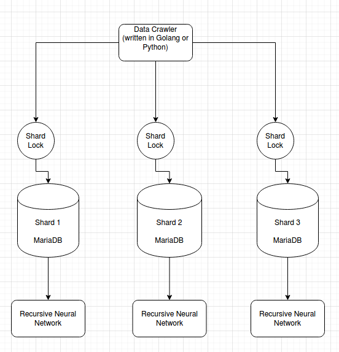
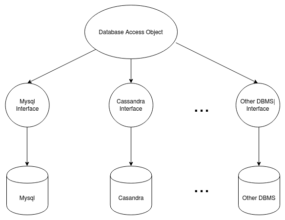
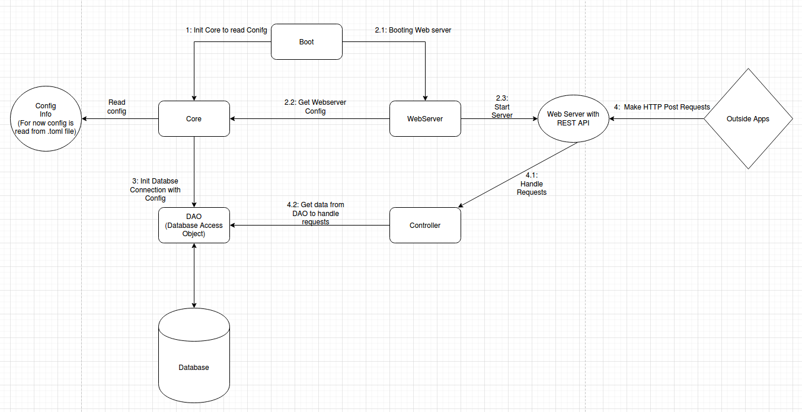

# SystemX

## 1) System Overall:
- Hệ thống bao gồm 3 components chính là:
    + Data Crawler (getStockData)
    + Price Generator
    + Poral API

- Dưới đây là hình ảnh tổng quan về sơ đồ  các components hệ thống tương tác:

### 1.1) Data Crawler:
- Data cralwer (getStockData) chịu trách nhiệm crawl dữ liệu giá cổ phiếu từ Yahoo Finance về. Sau đó đẩy vào Big Data Cluster. Big Data Cluster bao gồm các Database Shards như hình sau:

- Tại mỗi shard sẽ chứa giá của 1 tập cổ phiếu nhất định. Từ đó ta có thể train các neural network song song với nhau ở từng shard một. Từ đó tăng hiệu năng tính toán. Đồng thời cũng giải quyết bài toán về việc lượng dữ liệu là quá nhiều cho 1 database.

- Việc quyết định mã cổ phiếu A sẽ vào shard nào, hiện tại hệ thống sử dụng hàng hash fnv32 đề hash từ A về  một số n. Sau đó (shard ID của cổ phiếu A) = (n % số lượng shard).

- Data crawler được thiết kế theo design partern Abstraction Factory, nhờ đó việc thay đổi code hay áp dụng công nghệ mới cũng dễ dàng hơn. Cụ thể là việc mỗi shard có thể sử dụng một loại DBMS khác nhau. Hiện tại trong code chỉ support Mysql, nhưng ta nếu cần ta sẽ chỉ phải define thêm 1 interface khác cho các DBMS khác như hình sau.

#### Ưu điểm:
- Lượng data và work load được chia đều trên các shard. 
- Mỗi shard có thể sử dụng một loại DBMS khác nhau nhằm tăng hiệu năng read hoặc write data tùy ý.
- Việc push data vào các shard cũng được thực hiện song song, bởi vậy thời gian push data cũng giảm một lượng đáng kể tùy thuộc vào số lượng shard.

#### Nhược điểm:
- Dữ liệu bị phân tán. Dẫn đến việc quản lý dữ liệu sẽ là bài toán phúc tạp hơn.
- Việc implement concurrent computing cần được làm cẩn thận, ẩn chứa nhiều rủi ro.
- Tốn tài nguyên hơn so với hướng tiếp cận thông thường. Phải chịu network comunication overhead khi thực hiện requests (tuy không đáng kể).

### 1.2) Stock Price Predictor (Price_Generator):
### 1.3) Portal:
- Là component cuối cùng của hệ thống, chịu trách nhiệm xử lý request của người dùng và trả ra giá cổ phiếu được dự đoán. Dưới đây là tổng quan thiết kế của service này.

Như trên hình, portal bao gồm các package sau: boot, core, controller, webserver, và DAO.

Portal sẽ được boot bởi package boot. Quy trình như sau:

+ 1: boot sẽ init package core, để core đọc config của service từ file có dạng .toml.
+ 2: boot sẽ bắt đầu boot webserver (2.1). package webserver sẽ đọc config của webserver từ core (2.2). Sau khi lấy được config, webserver sẽ start 1 http server ở port 11000 (2.3). Tạo ra object Web Server with REST API như trên hình.
+ 3: từ config đọc được package core, cùng package DAO thực hiện init connection đến database.

Sau khi đã được boot xong. 1 request từ hệ thống ngoài sẽ được xử lý như sau:

+ 1: Object Web server with REST API sẽ nhận HTTP request từ bên ngoài (4), sau đó gọi đến package controller để sử lý (4.1).
+ 2: Controller sẽ thực hiện gọi đến package DAO để lấy data từ database để trả về response cho hệ thống ngoài.

Các package của portal cũng giống như của data crawler, được thiết kế theo design partern là Abstract Factory, từ đó tiện cho việc thay đổi code và thay đổi công nghệ.

### 2) Benchmark hệ thống: 

#### 2.1) Crawler performance:
+ Để ghi 3000 dòng record vào 1 shard, Crawler tốn khoảng thời gian giao động từ 11.6 - 13.4 giây (DBMS là mysql).

#### 2.2) Training Data Performance: 

